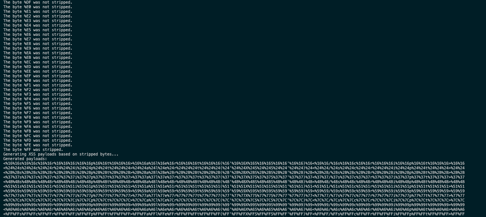

# WAF Fuzzing and XSS Payload Generator

## Description

This Python script is designed to fuzz a given URL to identify bytes and special characters that are stripped by a Web Application Firewall (WAF). Upon identification, the script generates XSS payloads designed to bypass the WAF using the stripped bytes.

## Features

1. Fuzzes a URL to identify stripped bytes and special characters.
2. Automatically generates XSS payloads based on identified stripped bytes.
3. Provides detailed output for analysis.

## Requirements

- Python 3.x
- `requests` library

## Installation

1. Clone the repository or download the Python script.
2. Install the `requests` library if you haven't already. You can install it using pip:
    ```
    pip install requests
    ```

## Usage

```shell
python3 byte_stripper.py https://example?parameter=[FUZZ]
```


## Output

The script provides real-time feedback during fuzzing, indicating whether each byte was stripped or not. After fuzzing, it prints the XSS payloads generated based on the stripped bytes.



## Future Enhancements

The following features are planned for upcoming releases:

1. Support for Raw HTTP Requests: The tool will be able to read raw HTTP requests from a file to perform fuzzing, eliminating the need to manually specify the URL in the command line.

## Disclaimer

This tool is intended for ethical hacking and lawful penetration testing activities. The developer assumes no liability for any misuse or damage caused by this program.


## Author

Zilbon, Pentester, OSCP
